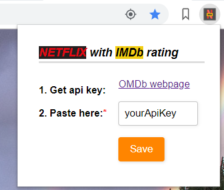

# Browse NETFLIX with IMDb ratings 
The extension displays IMDb rating of the movies on your Netflix browse page. Don't waste your time with looking after movie ratings on IMDb webpage any more. 

## Description
The extension makes it easier for you to decide which movie to watch based on IMDb rating if you care about. 

I often find myself in the situation I want to watch a new movie I have never seen but I dont want to waste my time and do the selection just based on a good cover photo or title. And I think that we all hate when we cannot choose a movie to watch in our short period of free time after an exhausting day at the office. Fortunately Netflix makes the choose easy for us because the browse page is full with better and better movies with good cover images. (No, its not that simple)

** Disclaimer ** Netflix and IMDb are registered trademarks, this extension is not affiliated with Netflix nor IMDb.

### Screenshots

### How it works:
The extension fetch the movie details from the [OMDb API Brian Fritz](https://www.omdbapi.com/) and display the ratings.
#### Provide API key
[Get your free!!! OMDb API key](https://www.omdbapi.com/apikey.aspx) and then click on the extension's icon at the chrome toolbar. Paste the key you got in email and save it and you ready to use.

#### In action
After you hovered a movie card with your cursor the rating will appear on the top right corner.

# Tasks & Imporvements

## v.0.0.1
- [x] Show rating on titles which appeared just after user activity happend on page (e.g. Scroll down, slider)
- [x] Use Chrome's local storage as cache to store already fetched ratings
- [X] Store titles and ratings in JSON format on local storage
- [X] Encode uri to escape special characters
- [X] Movie not found handling
- [x] Default Icon
- [x] Store API key in local storage
- [x] Setting on popup: Set OMDb API key
- [x] Style popup html
- [x] Add icons in multiple sizes
