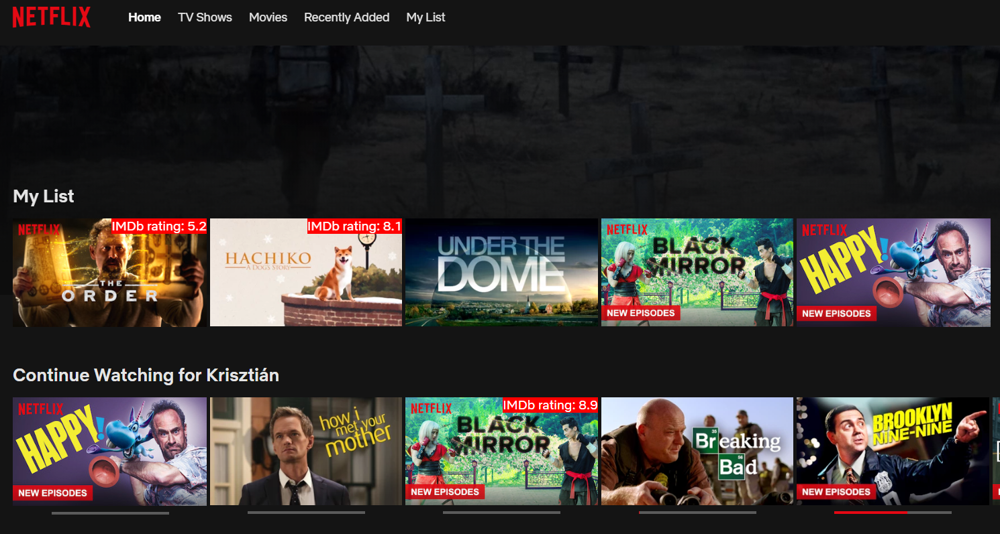

# Browse NETFLIX with IMDb ratings 
The extension displays IMDb rating of the movies on your Netflix browse page. 

## Descriptions
I often find myself in the situation I want to watch a new movie I have never seen but I dont want to waste my time and do the slection only based on a good cover photo.

Don't waste your time with looking after movie ratings on IMDb webpage any more because it will appear in Netflix. 

In the other hand the extension makes it easier for you to decide which movie to watch based on IMDb rating if you care about. 
We all hate when we cannot choose a movie to watch in our short period of free time after an exhausting day at the office. Fortunately Netflix makes the choose easy for us because the browse page is full with better and better movies. (No, its not that simple)

### Screenshots

### How it works:
The extension fetch the movie details from the [OMDb API](https://www.omdbapi.com/) and display the ratings.

After you hovered a movie card with your cursor the rating will appear on the top right corner. 

# Tasks & Imporvements

- [x] Show rating on titles which appeared just after user activity happend on page (e.g. Scroll down, slider)
- [x] Use Chrome's local storage as cache to store already fetched ratings
- [X] Store titles and ratings in JSON format on local storage
- [X] Encode uri to escape special characters
- [X] Movie not found handling

Extras:
- [ ] Reasearch other IMDb rating provider API
- [ ] Some GUI (Icon, menu, user options)
